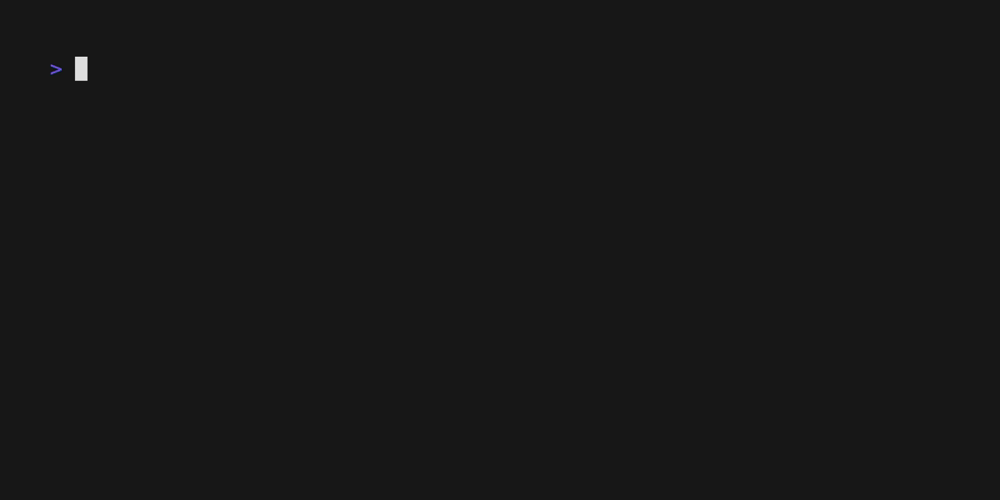

# Glue Backfill

This is a simple CLI to backfill glue jobs. It will run a glue job for each day between a start and end date.

## Prerequisites

You have the AWS CLI installed and your default profile has access to the Glue job.

## Usage

Here's an example using a fake job for the sake of time.

